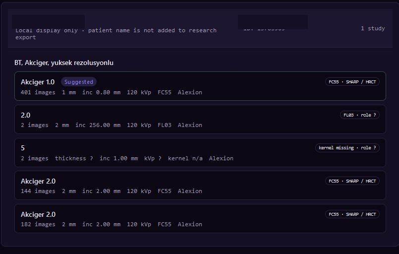
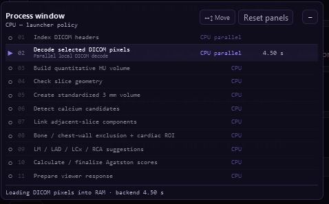
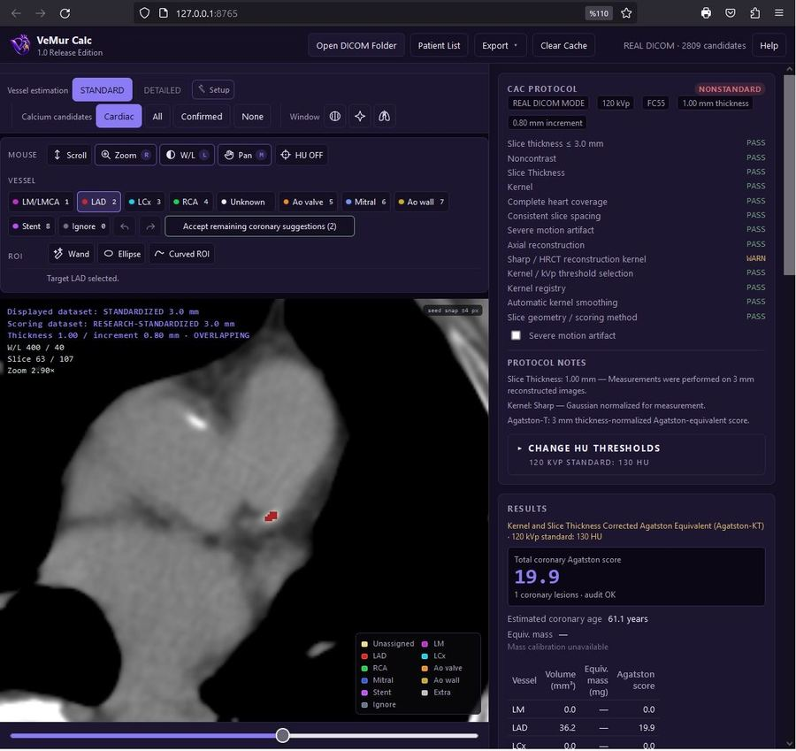
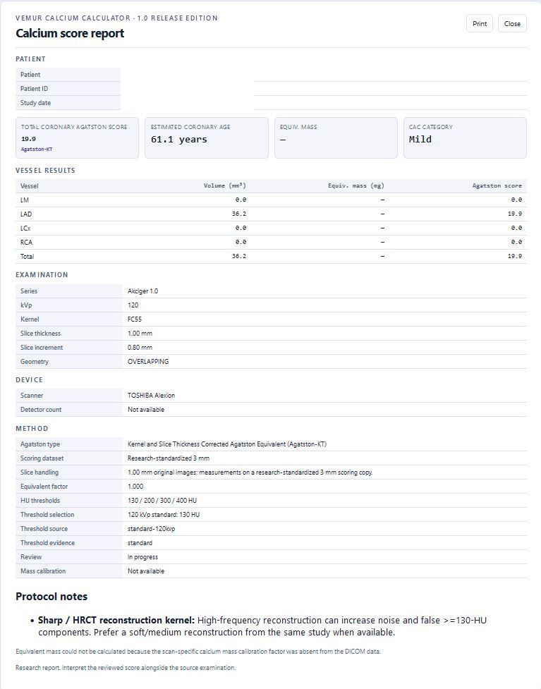

# VeMur Calcium Calculator — Hızlı Başlangıç

> **Yalnız araştırma amaçlıdır — klinik tanı amacıyla kullanılmamalıdır.**

Bu kılavuz VeMur Calcium Calculator v1.0'ın temel kullanım akışını özetler.

## 1. DICOM verisini açma

VeMur yerel DICOM verilerini üç yöntemle açabilir:

1. **Open DICOM Folder** — Windows klasör seçicisiyle çalışma klasörünü seçin.
2. **Klasör yolunu yapıştırma** — yerel DICOM klasör yolunu yazın/yapıştırın ve yükleyin.
3. **Sürükle-bırak** — desteklenen oturumlarda DICOM klasörü veya dosyalarını uygulamaya sürükleyin.

VeMur önce DICOM başlıklarını okuyarak **Hasta → Çalışma → Seri** listesini oluşturur. Piksel verileri ancak bir seri seçildikten sonra decode edilir.

## 2. Ölçüm için en uygun seriyi seçme

Bir çalışmada birden fazla BT serisi varsa VeMur mevcut metadata'yı değerlendirerek CAC ölçümü için uygun görünen seriyi **Suggested** olarak öne çıkarabilir.

Bu öneri seri seçimine yardımcı olur; doğru kontrastsız BT serisinin seçilmesi kullanıcının sorumluluğundadır.

Değerlendirilen başlıca özellikler kesit kalınlığı, kesit aralığı, rekonstrüksiyon kerneli, kVp, seri açıklaması ve serinin kabul edilen bir ölçüm matrisine yönlendirilebilir olup olmadığıdır.

## 3. İlk açılış neden biraz uzun sürebilir?

Seriyi açmak nicel işleme zincirini başlatır. VeMur gerekirse:

- DICOM piksel verilerini decode eder,
- saklanan piksel değerlerini HU'ya dönüştürür,
- kesit geometrisini değerlendirir,
- aktif protokol profilini seçer,
- gerektiğinde standardize 3.0 mm ölçüm matrisi oluşturur,
- gerektiğinde tanımlı kernel normalizasyonunu uygular,
- kalsiyum adaylarını saptar,
- kardiyak inceleme bölgesini belirler,
- ve damar önerilerini hazırlar.

Bu nedenle özellikle çok sayıda ince kesit içeren bir serinin ilk açılışı normal görüntü izlemeye göre daha uzun sürebilir.

## 4. Kalsiyum adaylarını inceleme

Üst araç çubuğundaki **Calcium candidates** bölümü hangi overlay'lerin gösterileceğini belirler:

- **Cardiac** — kardiyak/koroner inceleme için önceliklendirilen adaylar.
- **All** — saptanan tüm kalsiyum adayları.
- **Confirmed** — kullanıcı tarafından koroner kalsiyum olarak doğrulanmış odaklar.
- **None** — aday overlay'lerini gizler.

Otomatik adaylar tek başına nihai skor değildir.

## 5. Koroner damar atama

Bir adayı seçtikten sonra uygun koroner damara atayın: **LM, LAD, LCx veya RCA**.

Klavye kısayolları:

| Tuş | Damar/işlem |
| --- | --- |
| 1 | LM |
| 2 | LAD |
| 3 | LCx |
| 4 | RCA |
| 0 | Ignore |
| Enter | Seçili öneriyi kabul et |

Damar butonları ve klavye kısayolları seçili kalsiyum adayı üzerinde birlikte çalışır. Yalnızca kullanıcı tarafından gözden geçirilip LM, LAD, LCx veya RCA olarak doğrulanan lezyonlar reviewed koroner skora katkıda bulunur.

## 6. Manuel ROI ile düzeltme

Otomatik aday eksik, hatalı veya hiç saptanmamışsa VeMur **Wand, Ellipse ve Curved ROI** araçlarıyla manuel düzeltmeye izin verir.

Kullanıcı seçtiği kalsiyum alanını istediği koroner damara atayabilir. Manuel ROI ölçümü de aktif ölçüm matrisinin HU eşik profilini kullanır.

## 7. STANDARD ve DETAILED damar tahmini

VeMur iki damar lokalizasyon yaklaşımı sunar.

### STANDARD

STANDARD, VeMur'un dahili hafif anatomik/geometrik yöntemidir.

- doğrudan kullanılabilir,
- hızlıdır,
- ek model kurulumu gerektirmez,
- kardiyak adayların önceliklendirilmesine ve olası damar bölgesinin önerilmesine yardımcı olur.

### DETAILED

DETAILED, üçüncü taraf **SEGMENT-CACS** 3B modelini kullanır.

- opsiyoneldir,
- **Setup / Repair** üzerinden kurulur,
- STANDARD'a göre daha büyük ve daha yavaştır,
- daha ayrıntılı anatomi/damar lokalizasyonu için tasarlanmıştır,
- uygun GPU/CUDA donanımı varsa işlem süresi belirgin şekilde azalabilir.

DETAILED kalsiyum skorlama matematiğinin yerine geçmez. Anatomi/damar lokalizasyonuna yardımcı olur; nihai sonuç yine kullanıcı kontrolündedir.

## 8. VeMur heterojen BT verisini nasıl uyarlar?

VeMur'u sabit protokollü klasik kalsiyum skorlama iş akışından ayıran temel özellik, ölçümden önce çekim ve rekonstrüksiyon özelliklerini değerlendirmesidir.

### Kesit kalınlığı ve kesit aralığı

Kabul edilen CAC geometrisine uygun native seriler doğrudan ölçülebilir.

Hedef ölçüm geometrisinden daha ince ve uygun kaynak verilerde VeMur fiziksel z-ekseni entegrasyonu kullanarak **non-overlapping 3.0 mm araştırma ölçüm matrisi** oluşturabilir.

Desteklenen skor geometrisinden daha kalın seriler sessizce standart skora dönüştürülmez; uygulamanın scorability kurallarına göre ele alınır.

### Rekonstrüksiyon kerneli

Çok sert bir rekonstrüksiyon, kalsiyum görünümünü ve HU davranışını etkileyebilir.

Önceden tanımlanmış uygun sharp-kernel koşullarında VeMur ölçüm için kontrollü **Gaussian normalizasyon** uygulayabilir. Kaynak DICOM değiştirilmez; düzeltme türetilmiş ölçüm yoluna uygulanır ve raporda belirtilir.

### Tüp voltajı (kVp)

Klasik 120-kVp Agatston yönteminde alt kalsiyum eşiği 130 HU'dur.

Desteklenen 120-kVp dışı araştırma profillerinde VeMur protokole özgü HU eşikleri kullanır. Örneğin:

- **120 kVp:** T1 = 130 HU
- **sıradan 90-kVp araştırma profili:** T1 = 162 HU

Mevcut sıradan 90-kVp profili, seçilmiş 80 ve 100 kVp profilleri arasında araştırmacı tarafından tanımlanmış deneysel bir interpolasyondur; evrensel klinik eşik olarak yorumlanmamalıdır.

### Eşdeğer/vendor-aware ölçüm yolları

Tanınan kalsiyum-duyarlı/eşdeğer rekonstrüksiyon koşulları gereksiz 3-mm yeniden örnekleme yapılmadan Agatston-eşdeğer ölçüm yoluna yönlendirilebilir.

## 9. Skor kimliğini anlama

VeMur yalnız sayısal skoru değil, skorun hangi ölçüm yoluyla üretildiğini de raporlar.

Uygun klasik native çekim **Agatston** olarak gösterilebilir.

Düzeltme veya eşdeğer yönlendirme kullanıldığında raporda Agatston-eşdeğer skor kimliği görülebilir. Kernel ve kesit kalınlığı düzeltmesinin birlikte uygulandığı mevcut arayüzde örneğin:

**Agatston-KT — Kernel and Slice Thickness Corrected Agatston Equivalent**

ifadesi gösterilebilir.

## 10. Sonuçları dışa aktarma

**Export** menüsünden araştırma çıktıları oluşturulabilir:

- CSV
- JSON
- ayrıntılı rapor
- annotated DICOM
- MP4 inceleme çıktısı
- yapılandırılmış araştırma verisi

Ayrıntılı rapor; reviewed sonucu, skor kimliğini, kaynak kesit kalınlığı ve kesit aralığını, kVp'yi, rekonstrüksiyon kernelini, aktif HU eşiklerini, standardizasyon/normalizasyon basamaklarını ve inceleme durumunu birlikte gösterir.

## Temel ilke

VeMur bilinçli olarak **radyolog kontrollü** tasarlanmıştır.

Otomatik kalsiyum tespiti ve damar tahmini yardımcı katmanlardır. Araştırmada esas sonuç, insan tarafından gözden geçirilip düzeltilmiş reviewed skordur.
